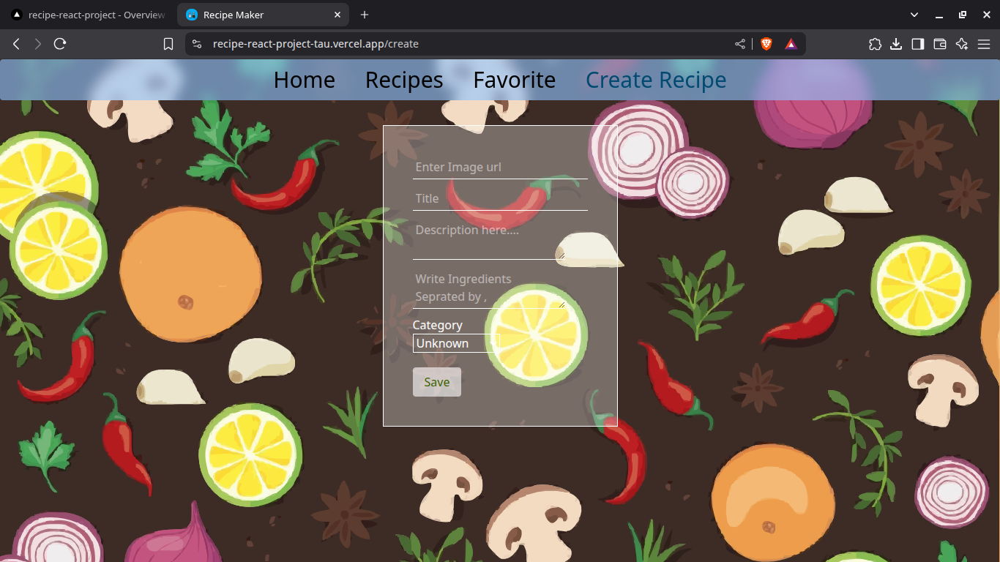
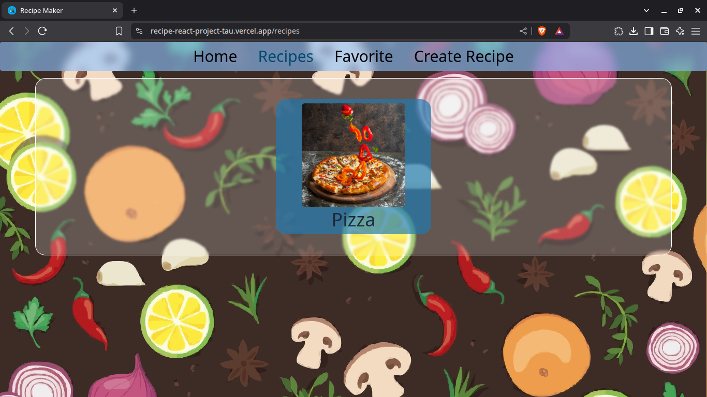
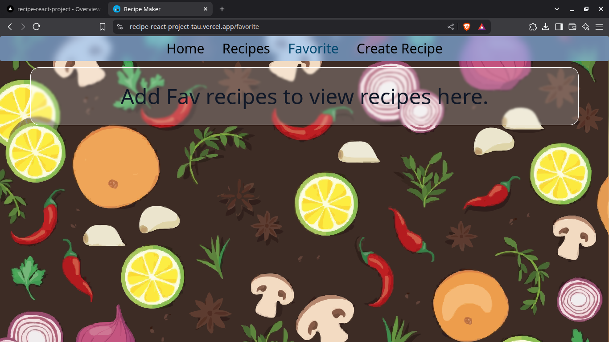
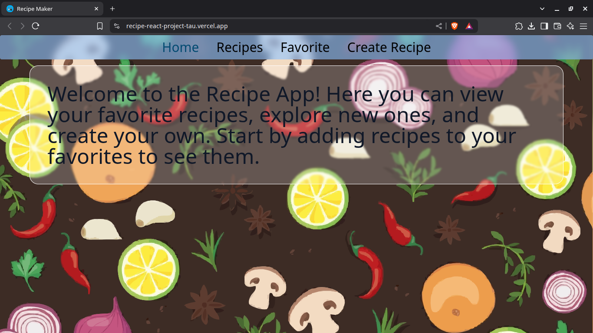

# 📄 Recipe App - Overview

## 🔗 Live Preview  
🌐 [Visit the Live App](https://vercel.com/zerosachindevs-projects/recipe-react-project)

### 🖼️ Preview Screenshots  

&nbsp;&nbsp;

&nbsp;&nbsp;

&nbsp;&nbsp;

---

## 📦 Data Handling

### Where is data stored?
Favorite recipes are stored in `localStorage` under the key `"fav"`.

### How is data used?
1. On component load, the Home page fetches `fav` data from `localStorage`.
2. If the data exists and contains recipes:
   - It maps over the array and displays each item using the `Recipecard` component.
3. If the data is `null` or an empty array:
   - A message is displayed: `"Add Fav recipes to view recipes here."`

---

## ✍️ UI Explanation

### Elements on Home Page:

- **Intro Paragraph**:  
  A paragraph welcoming the user and describing the app's purpose.
  ```text
  Welcome to the Recipe App! Here you can view your favorite recipes, explore new ones, and create your own.